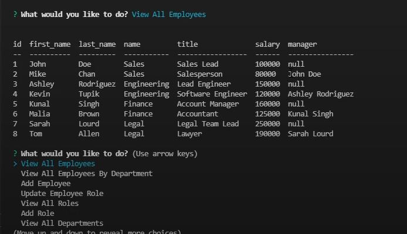

# Employee Tracker

## Description:

```md
as a business owner
I want to be able to view and manage the departments, roles, and employees in my company
so that I can organize and plan my business
```
## How to use

1. Run the command "npm i" in the terminal to download the node_modules folder
2. In the terminal login into mysql and run the commands "source db/schema.sql" and "source db/seeds.sql"
3. once this is done you can type the command "npm start" in a seperate terminal to start.


[link to tutorial](https://youtu.be/faZiSZRR9NA)


